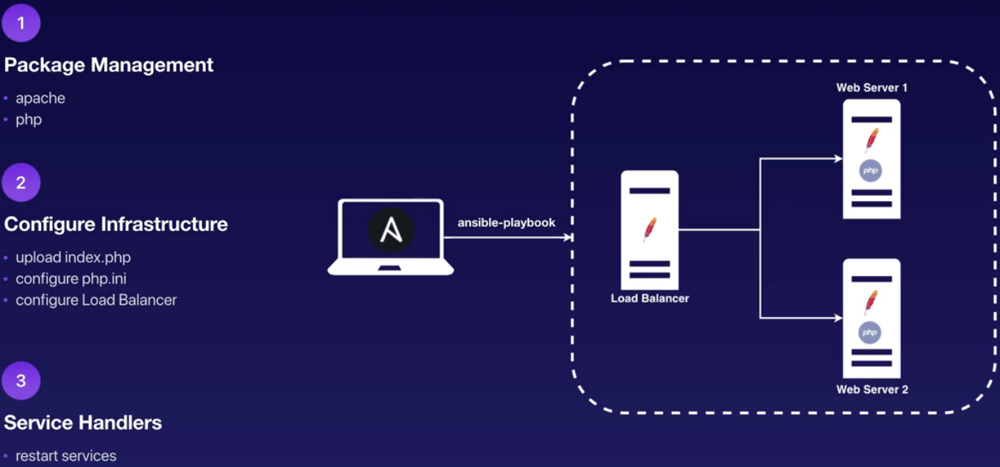
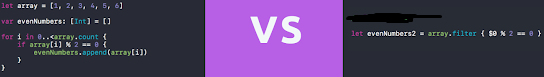
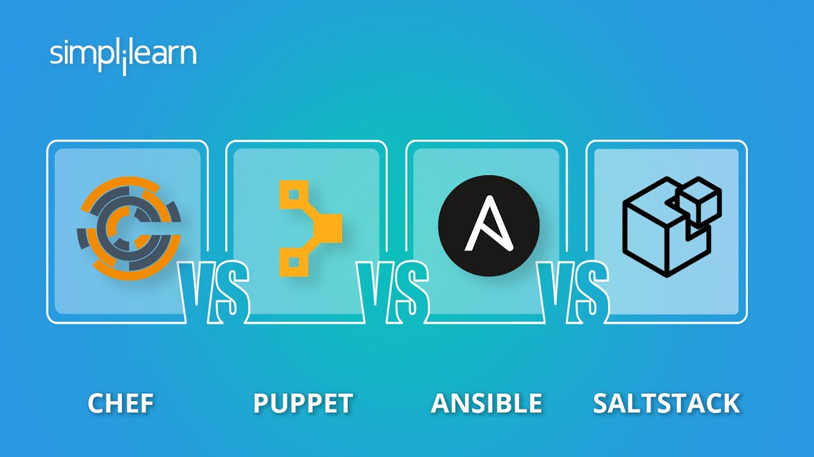
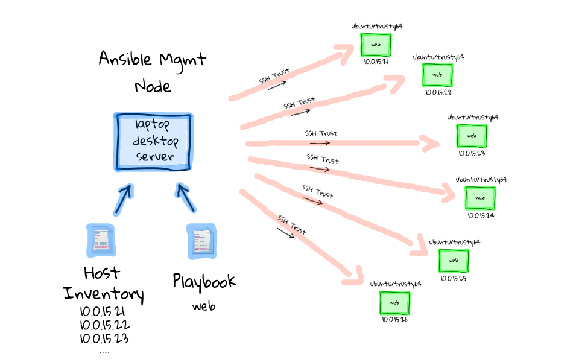
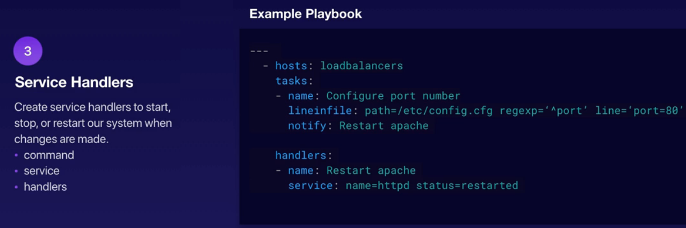
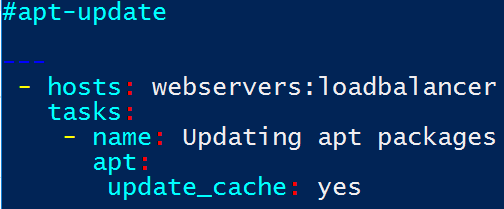
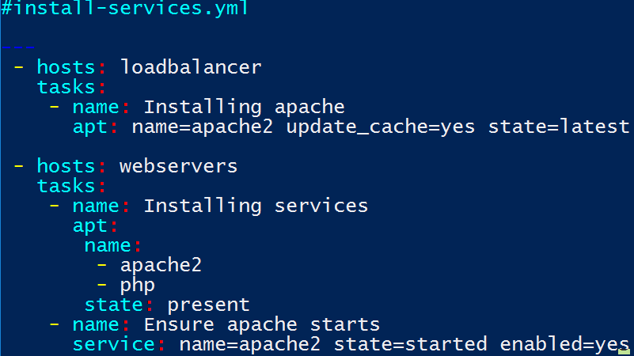
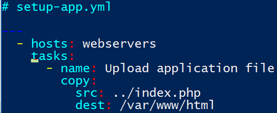
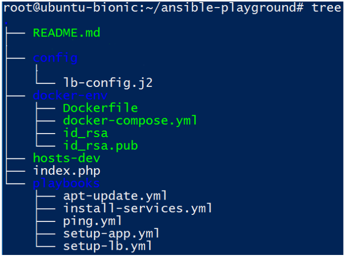

# Administració Remota amb Ansible

# Prerequisits

Per desenvolupar aquesta pràctica necessitaràs tenir uns coneixements bàsics sobre VirtualBox, Vagrant, Git (control de versions), OpenSSH, Docker i Docker Compose.

# Objectius (6 hores)

Entendre els conceptes d’administració remota de sistemes operatius en xarxa mitjançant Ansible, que fa servir SSH per instal·lar i configurar software en remot, permetent l’aprovisionament de màquines mitjançant una sintaxi declarativa. Es contextualitzarà la tecnologia Ansible en el marc DevOps que domina l’administració de sistemes en l’actualitat i es compararà amb la resta de competidors.

Al final de la pràctica l’alumne haurà estat capaç de poder aprovisionar de manera automàtica un cluster format per tres nodes, un en mode proxy invers fent el papel de load balancer, i dos com a servidors web. Totes tres màquines s’executen en contenidors Docker sobre i corren Apache sobre Ubuntu, gràcies a l’execució d’un *docker-compose*. L’entorn virtual on es muntarà vindrà donat per Vagrant fent VirtualBox com a proveïdor.

La il·lustració inferior mostra la topologia i les diferents fases en què transcorrerà la pràctica. El portàtil representa la VM creada per Vagrant (*management node*), i els tres nodes del clúster són contenidors de Docker. Tots es troben a la mateixa xarxa de tipus bridge creada per Docker al docker-compose.yml. S’ha de tenir present aquesta topologia durant tota la part pràctica de l’activitat.

# Webgrafia

1. [QUÉ ES ANSIBLE](https://www.youtube.com/watch?v=uqMkIdLE0AQ) 📹 (vídeo)

2. [https://sysadmincasts.com/episodes/43-19-minutes-with-ansible-part-1-4](https://sysadmincasts.com/episodes/43-19-minutes-with-ansible-part-1-4) 📹 + 📝

3. [An Ansible2 Tutorial](https://serversforhackers.com/c/an-ansible2-tutorial) 📝(tutorial)

4. [Infrastructure as Code: Chef, Ansible, Puppet, or Terraform?](https://www.ibm.com/cloud/blog/chef-ansible-puppet-terraform)  📝

5. [What Is Ansible | Configuration Management With Ansible](https://www.edureka.co/blog/what-is-ansible/?utm_source=youtube&utm_medium=description-link&utm_campaign=id) 📹 + 📝

6. *[How To Setup Ansible Master-Slave and Install Apache Web Serve*r](https://blogs.tensult.com/2019/12/19/how-to-setup-ansible-master-slave-install-apache-web-server/) 📝

# Repositori GitHub

# Què és Ansible?

*Ansible *és un software gestor de configuració remota i una eina d’orquestració. Treballa com un motor d’automatizació IT, i això vol dir fonamentalment que ajuda els *sysadmins *a fer desplegaments/aprovisionaments de manera remota.

És un projecte *open-source* que manté l’empresa *Ansible Inc.* i que va llençar el 2012. Ara bé, *Red Hat* va adquirir aquesta companyia el 2015, i tot i que Ansible continua sent open-source i gratuït Red Hat ha creat altres productes de valor afegit al seu voltant com *Ansible Tower*.

Visualitza aquest [vídeo en castellà de 6 min](https://www.youtube.com/watch?v=uqMkIdLE0AQ) i respon a les següents preguntes:

1. Com definiries amb les teves paraules el terme aprovisionament que es fa servir al vídeo. Pots posar un exemple.

*Respon*

2. Indica quin dels dos codis que veus en aquest exemple és declaratiu i per què.

*Respon*

3. El vídeo indica el caràcter modular d’Ansible i mostra la pàgina amb el catàleg. Ens diuen que Ansible té un mòdul dedicat a la monitorització del software Nagios que estigui instal·lat en un màquina remota. Podries indicar captura de pantalla de la pàgina d’aquest mòdul d’Ansible?

*Respon*

4. És possible executar Ansible sobre un Windows?

*Respon*

5. Com es diu el creador d’Ansible?

*Respon*

6. Sobre la diapositiva que apareix per al min 5:28. Mirant la nostra topologia. Quin és el controlador i quins els nodes?

*Respon*

## Declaratiu vs Imperatiu

Llegeix aquesta definició de programació imperativa i declarativa aplicada a DevOps, i que també aplica a Ansible:

<table>
  <tr>
    <td>DevOps paradigms (Declarative vs Imperative)

An automation framework can be designed and implemented in two different ways:imperative vs declarative . These are called DevOps paradigms. 

While using an imperative paradigm, the user is responsible for defining exact steps which are necessary to achieve the end goal, such as instructions for software installation, configuration, database creation, etc. Those steps are later executed in a fully automated way. The ultimate state of the environment is a result of particular operations defined by the user. While keeping full control over the automation framework, users have to carefully plan every step and the sequence in which they are executed. Although suitable for small deployments, imperative DevOps does not scale and fails while deploying big software environments, such as OpenStack.

In turn, a declarative paradigm takes a different approach. Instead of defining exact steps to be executed, the ultimate state is defined. The user declares how many machines will be deployed, will workloads be virtualised or containerised, which applications will be deployed, how will they be configured, etc. However, the user does not define the steps to achieve it. Instead, a ‘magic’ code is executed which takes care of all necessary operations to achieve the desired end state. By choosing a declarative paradigm, users not only save a lot of time usually spent on defining the exact steps but also benefit from the abstraction layer being introduced. Instead of focusing on the ‘how’, they can focus on the ‘what’.
Font: https://ubuntu.com/blog/declarative-vs-imperative-devops-done-right
</td>
  </tr>
</table>

Observa aquesta il·lustració i raona quina metodologia, dreta o esquerra, pertany a la declarativa i per què.

7. Retalla i enganxa cadascuna d’aquestes expressions (són idees o bé tecnologies d’un o altre tipus) en una o altra columna. **Ves afegint files a la taula segons necessitis**:

* Bash script

* Terraform

* Perform step-by-step tasks and manage changes in state

* Describe what you want as and end result

* SQL

* Ansible

* C

* C++

* Explicit instruction

* Describe the outcome

* The system is smart, you don’t care

* The system is stupid, you are smart

* Tell what, not how

* Tell what and tell how

*Emplena*

<table>
  <tr>
    <td>DECLARATIU</td>
    <td>IMPERATIU </td>
  </tr>
  <tr>
    <td></td>
    <td></td>
  </tr>
  <tr>
    <td></td>
    <td></td>
  </tr>
  <tr>
    <td></td>
    <td></td>
  </tr>
  <tr>
    <td>...</td>
    <td>...</td>
  </tr>
</table>

## Infrastructure as Code

*Parlem de tecnologies Infrastructure as Code als processos de gestió d’aprovisionament de data centers a través de fitxers de definició llegibles per una màquina, més aviat que per l’ús d’eines de configuració interactives.*[Wikipedia]

Per exemple, deixant de banda els scripts bash que hi puguem afegir, el fitxer *Vagrantfile *és un exemple de metodologia declarativa. Penseu com és de fàcil canviar de *provisioner *(de VBox a AWS, per ex.) sense donar cap instrucció!

Fins i tot, dintre de la part *provision *de Vagrant, si afegeixes una línia i tornes a executar vagrant provision, veuràs que Vagrant no executarà tot el codi, sinó tan sols la línia afegida.

*Dockerfile *també és un exemple de IaC ([per saber més](https://rancher.com/containers-making-infrastructure-code-easier)) i Cloudformation i Terraform també ho són. Altres exemples d’IaC són les pipelines de Jenkins (atenció, les *pipelines *amb codi declaratiu que vam veure a la pràctica, no les d’scripting, que són imperatives). A Kubernetes aquesta diferència també es troba ben establerta i pots crear objectes tant de forma imperativa, bàsicament des de la CLI, com declarativa (i en aquest cas ofereix la possibilitat de fer-ho amb el mateix llenguatge que fem servir a Ansible: YAML).

## Competidors d’Ansible en l’automatització IT

No tractarem d’ells de forma específica els altres programes que veus a la il·lustració i que també es fan servir per aprovisionar i automatitzar tasques en servidors, però sí que convé saber que un dels grans avantatges que presenta Ansible respecte tots ells: Ansible és *agentless*, això vol dir que no necessita de la instal·lació de cap software específic propi en els servidors remots. Això sí, necessitaran Python. Puppet (2005) és més antic que Ansible, però aquest té l’impuls de Red Hat. Sense entrar en els detalls de la resta de programes, aquests són els punts forts d’Ansible:

* **Agentless**, no requereix de software propi als servidors remots (bé només Python, però això no és propi d’Ansible).

* Instal·lació molt fàcil i a més amb alternatives (apt, pip)

* Configuració declarativa amb YAML (un llenguatge de formateig ben conegut)

* Configuració per PUSH (és el servidor central qui s’encarrega de donar les ordres d’automatització als nodes remots).

## Com s’instal·la Ansible?

Deixant de banda instal·lacions basades en la compilació del codi font, podem instal·lar directament amb el **gestor de paquets** d’Ubuntu (o qualsevol altra distribució que els suporti) de la següent manera:

$ sudo apt update

$ sudo apt install ansible

Si volem obtenir la versió més actualitzada es pot carregar primer el repositori oficial:

$ sudo add-apt-repository ppa:ansible/ansible

i a continuació executem les dues mateixes comandes anteriors.

Un altre mètode alternatiu: com que Ansible està escrit amb Python, també suporta la instal·lació mitjançant el gestor de paquets **pip**.

$ sudo pip install ansible

Per comprovar que la instal·lació ha estat correcta escriu ansible sobre la consola, i comprova que el programa et mostra el contingut de l’ajuda amb les diferents opcions disponibles.

Pots repassar el procés d’instal·lació d’Ansible en [aquest vídeo](https://www.youtube.com/watch?v=Zimn-UCbQ0A)  📹 de 6 min per si t’ha queda cap dubte.

# Fes-ho tu mateix! 💪

Tal i com indica la primera il·lustració, la de la topologia, l’entorn d’aprenentatge d’Ansible suposa tenir a l’abast una infrastructura formada per un ordinador controlador (*management node*) i els remots sobre els que opera dins la mateixa xarxa.

Per tal d’emular un entorn on aprendre **treballarem amb una màquina virtual Ubuntu creada sobre Vagrant**, que portarà instal·lada Docker. Un script de **Docker Compose** ens permetrà arrencar els tres nodes en mode bridge dintre de la màquina virtual, sobre els quals Ubuntu farà de manager (serà aquí on instal·larem Ansible).

Crearem un projecte d’Ansible que permeti desplegar de manera automatitzada, en aquests tres nodes, dos servidors webs Apache amb un altre  a davant, també Apache, configurat en mode **proxy invers**, de forma que vagi repartint la càrrega de les peticions web entre els altres dos nodes.

## Clona el repositori

Executa sudo su

Clona el repositori que conté el codi base a partir del qual crear el nostre entorn dins la carpeta /root (no ho facis, o almenys no executis, a /vagrant perquè hi ha problemes de permisos en estar compartida amb Windows). Sempre estarem a /root.

*Indica la comanda amb què has clonat el projecte.*

*Observa el Vagrantfile. Quina memòria RAM requerirà la VM que instanciaràs. Quantes CPU*? Ajusta els paràmetres al teu equipament, però tingues en compte que hauria de tenir mínim 2GB de RAM.

*Quin sistema operatiu fa servir la VM?*

## Arrenca la VM Vagrant i instal·la Ansible

Arrenca la VM amb vagrant up. Entra a ella mitjançant la comanda que inclou ssh.

*Amb quina comanda entres a la VM que acabes de crear?*

Instal·la Ansible amb el gestor de paquets tal i com s’ha indicat anteriorment. No oblidis actualitzar els repositoris per obtenir la versió més moderna.

*Mostra captura de pantalla on s’indica la versió de l’Ansible instal·lada.*

## Creació imatge Docker ubuntu-ssh

Els contenidors que faran de nodes remots fan servir una imatge d’Ubuntu especialment preparada per tal de ser operativa des del punt de vista servidor SSH, que és el que necessita el controlador d’Ansible per tal de comunicar-se amb ella.

I aquests contenidors els instanciaràs a partir d’una imatge que construiràs en el teu sistema a partir del Dockerfile que trobaràs a la carpeta /docker-env del repositori. Observa aquest fitxer i respon:

*Escriu la línia del fitxer Dockerfile que indica el fus horari que tindran els contenidors de la imatge que es crearà*

*Escriu la línia que permetrà que et pugui connectar com a root al servidor SSH remot*

*Escriu la línia que permetrà copiar a la imatge una clau pública RSA que es troba a la mateixa carpeta de Dockerfile.*

*Escriu la línia que permet obrir el port corresponent a les connexions SSH*

*Quina línia impedirà que et connectis per SSH a la màquina remota amb un altre usuari que no sigui root ? (pista: consulta man sshd_config)*

Ara crea la imatge corresponent a aquest Dockerfile. S’ha de dir *ubuntu-ssh*

*Comprova primer quantes imatges Docker hi ha ara mateix. Mostra captura pantalla llistat.*

*Quina comanda has fet servir per crear la imatge?*

*Mostra captura de pantalla de la comanda docker images*

*Per què apareixen dues imatges Docker si tu has creat una?*

## Execució de docker-compose.yml i configuració de /etc/hosts

A continuació crearem els contenidors a partir d’aquesta imatge però ho farem automàticament executant un fitxer de Docker Compose. Observa docker-compose.yml

*Quants contenidors s’instancien en executar aquest fitxer?*

*De quina imatge derivaran?*

*En quina xarxa s’inclouran?*

Executa aquest script de Docker Compose amb la comanda docker-compose up -d

*De quina manera comproves que les ips assignades a aquests contenidors són les indicades al fitxer YAML de docker-compose.yml? Mostra una captura de pantalla d’almenys la comprovació en un dels contenidors.*

*Mostra captura de pantalla als pings des de la VM d’almenys un dels contenidors*

Donat que hi ha diversos contenidors i és complicat enrecordar totes les ip, aprofitant que docker-compose.yml ha assignat un hostname a cadascun dels contenidors modifica el fitxer */etc/hosts* de la VM per tal de poder pings per hostname.

*Mostra captura de pantalla de /etc/hosts modificat*

*Mostra captura de pantalla de un ping per hostname a un dels contenidors*

## Connexió per ssh

Recordar que, per facilitar la pràctica,  totes les comandes s’executen com a root, i el repositori el descarreguem a /root. Tal i com has pogut comprovar al *Dockerfile*, aquestes contenidors provenen d’una imatge en què s’ha carregat una clau pública que teníem clonada del repositori. Et demanen que, un cop instanciats aquests contenidors, comprovis que aquesta clau pública es troba en ells. Recorda que és possible executar una comanda remota en un contenidor Docker (no té res a veure amb ssh, es fa amb *docker exec*)

*Indica captura de pantalla del contingut del fitxer /root/.ssh/authorized_keys on es troba la clau pública. Coincideix amb la que es troba a la carpeta docker-env del repositori?*

Tenint en compte que tens disponible  a la carpeta /docker-env del repositori la clau privada complementària a la pública, i que hem configurat els servidors openssh dels contenidors per tal que acceptin connexions directes per claus de part de l’usuari root, indica quines accions duus a terme a la VM per tal que amb la comanda ssh root@app1.test entris directament a aquest contenidor.

*Indica clarament les comandes que has fet servir i adjunta les captures de pantalles que creïs convenient per explicar-ho.*

## Ansible. Inventory.

Ansible necessita tenir la seva *llibreta d’adreces* on trobar tots els servidors que ha d’aprovisionar. Aquest fitxer s’anomena **inventari o inventory** i en ell s’emmagatzemen els hostnames (més exactament els *Fully Qualified Domain Name (FQDN)*) o ips dels servidors on s’aplicaran les tasques.

Visualitza aquest [video](https://www.youtube.com/watch?v=VgnidinNlkQ&list=PLTd5ehIj0goP2RSCvTiz3-Cko8U6SQV1P&index=3) 📹 de 7 min, en ell s’explica on es troba aquest fitxer i com s’articula el seu contingut.

*Quina és la ruta per defecte té aquest fitxer que fa d’inventari?*

Elimina o comenta el contingut d’aquest fitxer inventari

Crea en ell dos grups: *loadbalancer *i *webservers*. En el primer posar el hostname (o ip) del loadbalancer, i en el segon el dels dos *webservers*. Així podràs fer proves contra tots ells o bé per grups, com veurem a continuació.

*Mostra captura de pantalla de fitxer /etc/ansible/hosts*

## Primera prova: ping remot

Per comprovar que el controlador Ansible es pot comunicar amb totes les màquines de l’inventari executa

ansible all -m ping

all indica que volem actuar sobre totes les màquines de l’inventari

-m ping indica el nom del mòdul Ansible que volem cridar. En aquest cas ping.

Com que és possible que sobre un mateix servidor controlador hi hagis diversos usuaris amb els seus propis inventories, podríem voler cridar Ansible passant un inventory diferent del que troba a la ruta per defecte. Copia aquest /etc/ansible/hosts a la ruta /root/ansible-playground, amb el nom hosts-dev i executa la mateixa crida anterior però passant per paràmetre el fitxer inventari que acabem de copiar. D’aquesta manera no estem permanentment lligats al de /etc/ansible/hosts.

ansible all -m ping -i /root/ansible-playground/hosts-dev

Comprova que pots fer pings per grups, substituint el terme **all **per cada un dels grups creats a inventory.

També pots comprovar que l’inventory que s’estat llegint per defecte és el correcte executant:

ansible --list-hosts webservers

ansible --list-hosts loadbalancer

*Mostra captura de pantalla de Ansible mòdul ping a grup loadbalancer de inventory hosts-dev*

*Mostra captura de pantalla de Ansible mòdul ping a grup webservers de inventory hosts-dev*

## El fitxer de configuració ansible.cfg

Molts programes de Linux tenen el seu fitxer de text pla amb les opcions de configuració (per ex. Samba, OpenSSH, etc.). Ansible també. El que passa és que, segons la [documentació](https://docs.ansible.com/ansible/latest/reference_appendices/config.html#ansible-configuration-settings) aquest fitxer de configuració ansible.cfg també pot residir en diverses localitzacions i hi ha unes prioritats establertes sobre les variables definides en aquests fitxer segons on es trobi.

Trobem un d’exemple a /etc/ansible/ansible.cfg.

En aquest fitxer ansible.cfg hauries de fer constar la clau privada i l’usuari si vols connectar Ansible contra una màquina que no tingués configurat el reconeixement de claus com ja tenim muntat en el nostre projecte.

Nosaltres el que farem serà modificar el fitxer /etc/ansible/ansible.cfg. Recordeu que en aquesta mena de fitxer els valors comentats són els que es troben per defecte. Descomentarem la línia #inventory i hi indicarem la ruta al nostre propi hosts-dev:

inventory      = /root/ansible-playground/hosts-dev
Gràcies a aquest canvi podrem dur a terme les mateixes operacions anteriors però sense necessitat d’indicar la ruta de l’inventari.

*Mostra captura de pantalla de Ansible mòdul ping a grup loadbalancer, però aquesta vegada sense indica l’argument de la ruta a l’inventari*

<table>
  <tr>
    <td>How do you stop Ansible from creating .retry files in the home directory? 😫

Si Ansible no ha aconseguit executar correctament un playbook, per defecte crea a la mateixa carpeta un arxiu d’extensió .retry amb el mateix nom del playbook. Això pot ser molest en determinats contextos i alguns desenvolupadors prefereixen que aquests fitxers no es creïn. Cerca per internet la solució per desactivar aquesta característica en el fitxer de configuració que hem tractat en aquest apartat. És molt senzilla!👍
</td>
  </tr>
</table>

*Explica la solució aportada per desactivar els fitxers .retry.*

## Tasks

Les **tasks **són les comandes més bàsiques que enviem a les màquines del nostre inventari, i que seran executades a través de les respectives connexions ssh. De fet l’exemple anterior de ping ja n’era un i prenent-lo com a model podem veure a la il·lustració com s’estructura qualsevol task. 

El retorn d’aquesta comanda vé donat pel resultat de l’execució en cadascuna de les màquines escollides.  Si tot ha anat bé serà SUCCESS a totes tres.

Atura un dels webservers amb la comanda *docker stop* *nomservidor [també pots fer servir containerid] *que trobaràs al resultat de la comanda *docker ps*.

*Mostra captura de pantalla amb comanda i resultats quan tornes a fer un ping al grup webservers però amb un dels dos apagats.*

Recorda reiniciar el contenidor id amb la comanda docker start

Ansible disposa d’un catàleg de mòduls, que pots consultar [aquí](https://docs.ansible.com/ansible/latest/modules/modules_by_category.html) que ens permet executar moltes ordres. Un dels mòduls més conegut és el de **shell**, que ens permet executar una ordre de la shell remota. Exemple:

ansible -m shell -a "uname" webservers:loadbalancer

*Mostra captura de pantalla*

*rc=0* és el return code, que en aquest és d’èxit.

És molt senzill provocar una comanda d’error. Fes servir el mateix mòdul shell però ara llegint amb *cat *un fitxer inexistent en les màquines remotes (inventa’t un nom de fitxer aleatori, segur que no existeix en els filesystems de les màquines remotes)

*Mostra captura de pantalla amb comanda i resultats quan tornes a fer un ping a totes les màquines de l’inventori*

Tot i que les tasks siguin una manera senzilla automatitzar accions contra màquines remote o com a mínim de provar l’entorn, la veritat és que Ansible proveeix d’eines encara més sofisticades per poder-ho fer: els **playbooks**.

<table>
  <tr>
    <td>📓Recorda:
</td>
  </tr>
</table>

## Playbooks

Les tasques es troben habitualment formant part de *playbooks*, uns fitxers on aquestes tasques consten seqüencialment i als quals podem afegir altres elements com per ex. variables.

Els playbooks segueixen una *sintaxi YAML*. Podem transformar la tasca ping anterior en un playbook com indica la il·lustració. Fes ho, el fitxer *playbook *tal i com pots veure s’ha d’anomenar *ping.yml* (crea una nova carpeta en el repositori que es digui /root/ansible-playground/playbooks, i inclou-lo allà)  i *mostra la captura de pantalla de la seva execució.*

 

En realitat els playbooks que trobaràs en els entorns de treball contenen diverses tasques, i estaran estructurats molt sovint d’una manera semblant perquè gairebé tots ells actualitzen, instal·len, configuren i comproven l’status del servei que acaben d’implementar.

Aquesta estructura tan habitual també es pot resumir en:

* Gestió de paquets

* Configuració de la infrastructura

* Service Handlers

Els **handlers **són tasques d’Ansible que només s’executen quan les crida un altra tasca, i fer ho fan a partir d’un event. Un handler molt habitual és aquell que ordena iniciar un servei prèviament instal·lat. En aquesta il·lustració, que mostra la instal·lació i arrencada d’un servidor Apache,  pots veure les tres fases per le sol passar un script d’Ansible i de quina manera la tasca, mitjançant la propietat **notify**, la tasca que instal·la nGinx acaba cridant el handler que el reinicia.

## ➀ Desplegament automatitzat d’un servidor web de dos nodes amb un balancejador de càrrega (Apache i PHP)

A la mateixa carpeta de playbooks crearem un playbook anomenat apt-update.yml que dugui a terme l’actualització dels repositoris de paquets a la darrera versió:

*Crida aquest playbook i comprova que funciona correctament. Mostra captura de pantalla. Recorda que un fitxer YAML no heu de fer servir tabulacions.*

Continuem amb la configuració de paquets, ara amb la **instal·lació de Apache2** a tots els nodes (al loadbalancer el farem servir en mode reverse proxy). A més als webservers instal·larem php, donat que allotjarem pàgines dinàmiques. Crea a la mateixa carpeta el playbook *install-services.yml*

Executa una primera vegada per comprovar que funciona i a continuació executa una segona vegada. Fixa’t, en l’apartat de resultats en PLAY RECAP, en concret en el camp **changed**

*Indica quina diferència hi ha en aquest camp del resultat la primera vegada que executes aquest playbook i les posteriors.*

El valor d’aquest camp està relacionat amb la característica de la **idempotència **que comparteix Ansible amb altres llenguatges declaratius. Ansible és idempotent perquè la seva declaració no executa processos indicats per l’usuari, sinó que s’encarrega de gestionar el sistema per tal que quedi en l’**estat** indicat al playbook. En els resultats que es mostren per consola en l’execució TASK [Gathering Facts] és la fase en què Ansible comprova com es troba el target. Si ja es troba en l’estat específicat pel playbook, no executarà res. De si s’han produït o no modificacions respecte a com estava el remot, dona compte el camp *changed*.

*Explica i mostra amb captures de pantalla de quina manera comproves que les màquines webservers tenen Apache2 funcionant*

## ➁ Upload index.php

Finalitzarem la configuració fent servir dos mòduls més molt coneguts d’Ansible: el que permet copiar fitxers (el farem servir per copiar un* index.php* als dos webservers) i el que permet editar fitxers remots afegint una línia.

Creem un fitxer index.php d’exemple a la carpeta ansible-playground, amb un codi que permet :

<?

// Show all information, defaults to INFO_ALL

echo "Aquesta es la pagina de prova Ansible PHP";

$ip_server = $_SERVER['SERVER_ADDR'];

echo "Server IP Address is: $ip_server";

?>

I a continuació crea un playbook anomenat *setup-app.yml* que contingui una tasca que permeti copiar el fitxer index.php als webservers, fent servir el mòdul *copy*: fixa’t que el fitxer que puja és el creat anteriorment a la carpeta superior:

*Executa aquest playbook i comprova que s’ha copiat en tots dos servidors. Mostra captures de pantalla.*

## Configuració de php.ini. Un exemple del mòdul Ansible d’edició de línies de fitxers

Un dels mòduls més coneguts d’Ansible és [lineinfile](https://docs.ansible.com/ansible/latest/modules/lineinfile_module.html), que permet fer edicions de fitxers remots modificant línies, afegint-ne de noves o esborrant-ne.

En aquest cas el farem servir per al nostre projecte perquè ens interessa que la configuració de php dels webservers permeti els anomenats short tags, de forma que pugui començar la pàgina amb <? en lloc de <?php. Podeu provar que això ara mateix no es permet.

El playbook, al mateix directori que la resta, que cridaria a aquest mòdul és:

# setup-app.yml

  - hosts: webservers

    tasks:

      - name: Upload application file

        copy:

          src: ../index.php

          dest: /var/www/html

          mode: 0755

      - name: Configure php.ini file

        lineinfile:

          path: /etc/php/7.2/apache2/php.ini

          regexp: ^short_open_tag

          line: 'short_open_tag=On'

        notify: restart apache

    handlers:

      - name: restart apache

        service: name=apache2 state=restarted

*Mostra captura de pantalla d’execució d’aquest playbook i mostra captura de pantalla de que la pàgina funciona en algun dels dos webservers.*

## Configuració de loadbalancer

*mod_proxy_balancer *és l’extensió d’Apache que permet fer balanceig de càrrega. Pots trobar els detalls de la configuració a la [pàgina oficial](https://httpd.apache.org/docs/2.4/mod/mod_proxy_balancer.html). Bàsicament el que necessitem és que el fitxer de configuració d’aquesta extensió hi constin les ips dels nodes als quals redirigirà les peticions:

 

Podríem substituir <IP_ADDRESS> per les ips dels dos webservers, acabar de completar aquest fitxer de configuració i funcionaria. Tanmateix, aquestes ips serien fixes, i si canviessin les ips del fitxer inventari, ja no servirien. Seria molt interessant que l’expressió BalancerMember es generés de manera dinàmica, en un bucle, a partir de la lectura del fitxer que fa d’inventari.

Ansible permet crear arxius de forma dinàmica a partir d’una plantilla escrita en **Jinja2**. Si creem la plantilla de configuració en aquest format, el que pujarà realment al node que fa de node balancer és la plantilla amb les variables de les ips substituïdes pels valors que trobarà al fitxer inventari. D’aquesta manera es guanya en la capacitat d’automatitzar aquest desplegament, donat que si més endavant canvien les ips, només s’ha de tocar l’inventari, cap altre fitxer de configuració més.

Aquest fitxer inclou altres directives pròpies d’Apache com ara la possibilitat d’habilitar un gestor web del load-balancer, a la url /balancer-manager per tal de mostrar el nombre de redireccions fetes. Pots trobar més informació sobre la configuració del balancer d’Apache a  [https://httpd.apache.org/docs/2.4/howto/reverse_proxy.html](https://httpd.apache.org/docs/2.4/howto/reverse_proxy.html)

Crea una carpeta *config *al nivell superior a la carpeta *ansible-playground, i crea el fitxer lb-config.j2*.

# config/lb-config.j2

ProxyRequests off

<Proxy balancer://webcluster >

  

    BalancerMember http://{{hostvars[hosts]['inventory_hostname']}}

  

    ProxySet lbmethod=byrequests

</Proxy>

<Location "/balancer-manager">

    SetHandler balancer-manager

    Order Deny,Allow

    Allow from all

</Location>

ProxyPass /balancer-manager !

ProxyPass / balancer://webcluster/

ProxyPassReverse / balancer://webcluster/

El playbook setup-lb.yml serà l’encarregat de deixar el fitxer de configuració al directori mods-enabled d’Apache de node loadbalancer,

# playbooks/setup-lb.yml

  - hosts: loadbalancer

    tasks:

    - name: Enable proxy module

      apache2_module: name=proxy identifier=proxy state=present

    - name: Enable http_proxy module

      apache2_module: name=proxy_http identifier=proxy_http state=present

    - name: Enable proxy_balancer

      apache2_module: name=proxy_balancer identifier=proxy_balancer_module state=present

    - name: Enable lbmethod_byrequests module

      apache2_module: name=lbmethod_byrequests identifier=lbmethod_byrequests state=present

    - name: Creating template

      template:

        src: ../config/lb-config.j2

        dest: /etc/apache2/conf-enabled/lb.conf

    - name: restart apache

      service: name=apache2 state=restarted

*Com es diu la tasca corresponent la configuració del load balancer?*

*Què fan les tasques del pla anteriors a la del load balancer?*

Un cop tenim aquests dos fitxers podem executar aquest playbook de configuració del *loadbalancer *amb:

ansible-playbook setup-lb.yml

Podràs veure la web ja que el *Vagrantfile *té una redirecció del port 80 de la ip de loadbalancer al 80 de l’amfitrió.

*Executa’l i comprova que s’ha copiat en servidor loadbalancer, en la ruta indica al playbook. Mostra captura de pantalla.*

*Respon: gràcies a quina línia específica de Dockerfile pots veure des de la VM la pàgina curl localhost:80/index.php. Mostra captura de pantalla.*

*Indica una altra adreça per accedir ***_des de la shell de VM_*** al load balancer, també amb curl. Mostra captura de pantalla.*

*Mostra captura de pantalla de **[http://ipvagrantmachine/index.ph*p](http://ipvagrantmachine/index.php)

*Mostra captura de pantalla del load-balancer manager. Si fas clic sobre els enllaços de WorkerURL veuràs que pots modificar la configuració Load Factor. Investiga quin Load Factor has de posar a app1.test per tal que registri el doble de hits que app2.test. Mostra captura de pantalla del canvi.*

## ➂ Handlers

Per què reiniciar el servei Apache… si no hi ha hagut canvis? *Handlers al rescat*.🙋

Sovint executem un playbook que al final reinicia un servei, per exemple Apache. Tanmateix, si analitzem el log, veurem que el canvi que volia efectuar, per exemple en un fitxer de configuració del servei, realment no s’ha efectuat… per què aleshores reiniciar Apache?

Per evitar aquestes situacions es van crear els handlers. Un handler és una task, com qualsevol altra, que només s’executarà si es cridar des d’una altra.

Anem a aplicar aquest concepte al nostre projecte.

Recorda que en el playbook setup-app.yml abans havíem modificat el php.ini per tal de permetre obrir etiquetes en mode ‘<?’. Cada vegada que executàvem aquella tasca que afegia una línia al final teníem una altra que reiniciava apache. Doncs bé, ara indicarem amb un handler que només es reinicïi apache si ho notifica la tasca de l’etiqueta a php.ini. 

      - name: Configure php.ini file

        lineinfile:

          path: /etc/php/7.2/apache2/php.ini

          regexp: ^short_open_tag

          line: 'short_open_tag=On'

        notify: restart apache

    handlers:

      - name: restart apache

        service: name=apache2 state=restarted

Observa el log de sortida d’Ansible en successives execucions. La primera vegada surt el log de reinici d’Apache.

*Mostra captura sortida Ansible amb reinici servidor.*

En successives execucions no hauria de sortir.

Entra en app1.test i executa:

grep resuming /var/log/apache2/error.log

*Respon a què correspon aquestes línies de sortida.*

## Tots els playbooks en un fitxer

Es poden executar tots els playbooks a la vegada important-los en un fitxer

#playbooks/all-playbooks.yml

  - import_playbook: apt-update.yml

  - import_playbook: install-services.yml

  - import_playbook: setup-app.yml

  - import_playbook: setup-lb.yml

*Puja al teu repositori de GitHub la pràctica completada i indica la url:*

*…...*

L’aspecte final del projecte webservers i reverse proxy amb Ansible hauria de ser aquest:

